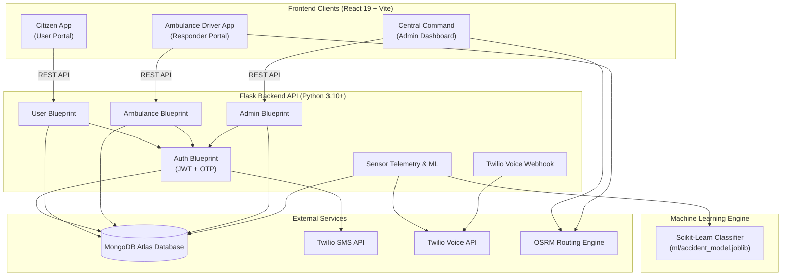
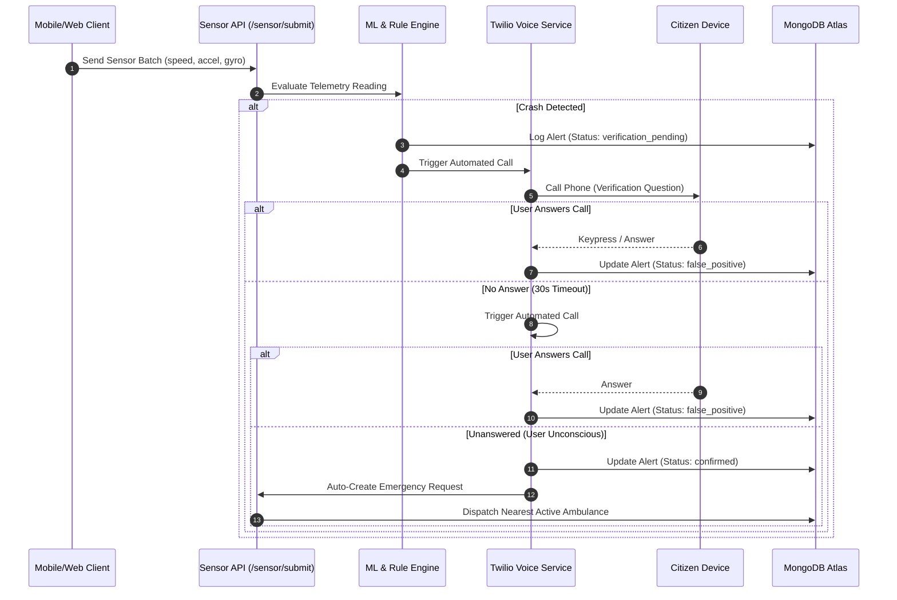

#CODEAMBLE-TZEN1-RakshakAI
# 🚨 RAKSHAK AI — Emergency Response System (ERS)

[](https://flask.palletsprojects.com/)
[](https://react.dev/)
[](https://www.mongodb.com/)
[](https://scikit-learn.org/)
[](https://www.twilio.com/)
[](https://leafletjs.com/)

**Rakshak AI** is an end-to-end, Uber-like emergency healthcare response and dispatch platform. It bridges citizens in distress with nearby ambulance responders in real-time, features a central admin dispatch map, and incorporates an AI/ML auto-accident detection pipeline with automated Twilio voice verification calls.

---

## 📋 Table of Contents

- [Project Overview & Problem Solved](#-project-overview--problem-solved)
- [Key Features](#-key-features)
- [Detailed Module Explanation](#-detailed-module-explanation)
- [System Architecture & Sequence Diagrams](#-system-architecture--sequence-diagrams)
- [Tech Stack](#-tech-stack)
- [Directory Structure](#-directory-structure)
- [Environment Configuration](#-environment-configuration)
- [Step-by-Step Installation & Setup](#-step-by-step-installation--setup)
- [Running the Application](#-running-the-application)
- [AI/ML Accident Detection Pipeline](#-aiml-accident-detection-pipeline)
- [Complete API Reference](#-complete-api-reference)
- [Database Schema](#-database-schema)
- [Local Developer OTP Workflow](#-local-developer-otp-workflow)

---

## 🌐 Project Overview & Problem Solved

During medical emergencies or severe vehicular accidents—especially in remote, highways, or rural regions—victims often face critical delays:
1. **Manual Dispatch Delays:** Traditional systems rely on manual emergency hotline operators, delaying dispatch.
2. **Unconsciousness / Inability to Call:** Victims in severe crashes may be incapacitated and unable to unlock their phone or call for help.
3. **Lack of Real-time Navigation & Tracking:** Responders lack exact victim GPS coordinates, and victims cannot see the approaching ambulance ETA or live location.

**Rakshak AI** solves these challenges by providing:
- **Instant 1-Tap SOS Dispatch:** Citizens broadcast their exact live GPS location to auto-assign the nearest available active ambulance using Haversine distance calculations.
- **AI/ML Sensor Telemetry Auto-Detection:** Monitors smartphone accelerometer, gyroscope, and speed telemetry to automatically detect collision patterns.
- **Automated Telephony Verification:** Initiates 2 automated Twilio voice verification calls to check if the user is responsive. If unanswered, an emergency dispatch is triggered automatically.
- **Three Dedicated Portals:** Citizen Portal, Ambulance Driver Portal, and Central Command Admin Dashboard.

---

## ✨ Key Features

### 👤 Citizen / User Portal
- **OTP Authentication:** Passwordless mobile phone login via OTP.
- **Instant SOS Emergency Dispatch:** Single-tap emergency request creation capturing live GPS coordinates.
- **Automatic Nearest Responder Matching:** Haversine distance-based matching that immediately assigns the closest active ambulance.
- **Live Location Tracking:** Interactive OpenStreetMap/Leaflet map displaying accident location, responder location, and real-time route pathing.
- **Emergency Medical Profile:** Manage blood group, emergency contact details, age, and medical records.

### 🚑 Ambulance Driver Portal
- **Responder Authentication:** OTP-based responder login and driver profile verification.
- **Availability Control:** Toggle between `Active` (ready for dispatch) and `Inactive` status.
- **Dispatch Management:** View incoming emergency assignments with victim details, phone numbers, and exact accident location coordinates.
- **Turn-by-Turn Navigation:** One-click external directions (Google Maps / Apple Maps integration) from driver's current position to victim location.
- **Trip Lifecycle:** Real-time driver location updates and trip completion workflow.

### 🏢 Central Admin Command Center
- **Live Incident Monitoring:** Real-time map dashboard plotting all active emergency incidents and responder movements.
- **Directory Management:** Overview of registered citizens, registered ambulances, and active/past emergency requests.
- **Manual & Auto-Dispatch Audit:** Monitor automatic responder assignments and inspect vehicle track paths.

### 🤖 AI/ML Accident Auto-Detection & Automated Voice Verification
- **Telemetry Processing:** Reads speed drops, accelerometer impact spikes, and gyroscope tilt sensors every 5 seconds.
- **Hybrid Machine Learning & Rule-based Classifier:** Trained Scikit-learn model backed by fallback detection heuristics for low-latency detection.
- **Automated Twilio Voice Verification:** Automatically initiates 2 sequential IVR verification calls when crash anomalies are detected. If unanswered (user unconscious), an emergency request is automatically dispatched.

### 🔑 Local Developer OTP Banner
- **On-Screen OTP Auto-Fill:** During local development, the backend returns the generated MongoDB OTP in the response, rendering an interactive banner on the login screen with an **Auto-fill OTP** button for friction-free testing.

---

## 🏗️ System Architecture & Sequence Diagrams



---

## 🛠️ Tech Stack

| Category | Technology |
|---|---|
| **Backend Framework** | Flask 3.0, Flask-PyMongo, Flask-JWT-Extended, Flask-CORS |
| **Database** | MongoDB Atlas / Local MongoDB (PyMongo) |
| **Frontend Framework** | React 19, Vite, React Router DOM v7 |
| **UI Components & Styling**| Vanilla CSS, Lucide React Icons |
| **Mapping & Routing** | Leaflet.js, React Leaflet, OpenStreetMap, OSRM API |
| **Machine Learning** | Scikit-Learn, Joblib, NumPy |
| **Telephony & Telematics** | Twilio SMS API, Twilio Voice (TwiML Webhooks) |
| **Authentication** | Passcode-less SMS/MongoDB OTP, JWT Token Bearer Authentication |

---

## 📁 Directory Structure

```
ERS-healthcare/
├── emergency-backend/
│   ├── app.py                      # Flask Application Entry Point & DB Initialization
│   ├── config.py                   # Global Configuration & Environment Variables
│   ├── requirements.txt            # Python Dependencies
│   ├── .env.example                # Template for Environment Variables
│   ├── RUN_LOCAL.bat               # 1-Click Launch Script for Backend & Frontend
│   │
│   ├── models/                     # Database Models & Helper Methods
│   │   ├── user_model.py           # User CRUD & Schema Operations
│   │   ├── ambulance_model.py      # Ambulance CRUD & Location Telemetry
│   │   ├── request_model.py        # Emergency Request Dispatch Logic
│   │   └── otp_model.py            # OTP Generation, Verification & Expiry
│   │
│   ├── routes/                     # Blueprint Route Controllers
│   │   ├── user_routes.py          # User Login, SOS Request & Profile APIs
│   │   ├── ambulance_routes.py     # Ambulance Login, Status, Location & Directions
│   │   ├── admin_routes.py        # Admin Login & Live Dashboard Map Telemetry
│   │   ├── sensor_routes.py       # Sensor Data Ingestion & Crash Trigger API
│   │   └── accident_webhook_routes.py # Twilio Voice Verification Webhook Handlers
│   │
│   ├── ml/                         # Machine Learning Modules
│   │   ├── accident_train.py       # Model Training Script for Crash Telemetry
│   │   └── accident_model.joblib   # Serialized ML Classifier Pipeline
│   │
│   ├── utils/                      # Helper Utilities
│   │   ├── otp.py                  # OTP Logic & Local Console Logger
│   │   ├── twilio_sms.py           # Twilio SMS Transceiver
│   │   └── distance.py             # Haversine Distance Calculation Engine
│   │
│   └── frontend/                   # React 19 + Vite Web Application
│       ├── src/
│       │   ├── api/                # Axios API Services (userApi, ambulanceApi, adminApi)
│       │   ├── context/            # Global Authentication Context (AuthContext)
│       │   ├── pages/
│       │   │   ├── user/           # UserLogin, UserProfile, UserDashboard
│       │   │   ├── ambulance/      # AmbulanceLogin, AmbulanceProfile, AmbulanceDashboard
│       │   │   └── admin/          # AdminLogin, AdminDashboard
│       │   ├── App.jsx             # Main Application Routing
│       │   └── main.jsx            # React App Mount Point
│       ├── package.json            # Node Dependencies & Scripts
│       └── vite.config.js          # Vite Server Proxy Configuration (/api -> http://localhost:5000)
```

---

## ⚙️ Environment Configuration

Create a `.env` file inside the `emergency-backend/` directory using `.env.example` as reference:

```env
# MongoDB Connection String
MONGO_URI=mongodb+srv://<username>:<password>@cluster0.xxxxx.mongodb.net/emergodb?retryWrites=true&w=majority

# JWT Security Key
JWT_SECRET_KEY=super-secret-jwt-key-change-this-in-production

# Central Admin Login Credentials
ADMIN_USERNAME=admin
ADMIN_PASSWORD=adminpassword123

# Twilio SMS API Credentials (Optional for local testing)
TWILIO_ACCOUNT_SID=ACxxxxxxxxxxxxxxxxxxxxxxxxxxxxxxxx
TWILIO_AUTH_TOKEN=xxxxxxxxxxxxxxxxxxxxxxxxxxxxxxxx
TWILIO_PHONE_NUMBER=+1234567890

# Public HTTPS Domain for Twilio Voice Call Webhooks (e.g. ngrok / production URL)
TWILIO_VOICE_WEBHOOK_BASE=https://your-domain.ngrok-free.app
```

---

## 🚀 Step-by-Step Installation & Setup

### Prerequisites
- **Python:** Version 3.10 or higher installed (`python --version`)
- **Node.js:** Version 18.0 or higher installed (`node -v`)
- **MongoDB:** Active MongoDB Atlas Cluster URI or local MongoDB instance

---

### Step 1: Clone Repository & Navigate
```bash
git clone https://github.com/Prashik-Sasane/ERS-healthcare.git
cd ERS-healthcare/emergency-backend
```

### Step 2: Set Up Backend Virtual Environment & Dependencies
```bash
# Create virtual environment
python -m venv venv

# Activate virtual environment
# Windows (PowerShell):
.\venv\Scripts\Activate.ps1
# Windows (CMD):
.\venv\Scripts\activate.bat
# macOS / Linux:
source venv/bin/activate

# Install required Python packages
pip install -r requirements.txt
```

### Step 3: Train Machine Learning Model (Optional)
To generate or refresh the crash detection model file `ml/accident_model.joblib`:
```bash
python -m ml.accident_train
```
*(If omitted, system automatically falls back to rule-based crash detection algorithm).*

### Step 4: Install Frontend Dependencies
```bash
# Navigate to frontend directory
cd frontend

# Install Node modules
npm install
```

---

## 🏃 Running the Application

### Option A: 1-Click Windows Launch (Recommended for Windows)
Double-click `emergency-backend/RUN_LOCAL.bat` or run from terminal:
```cmd
.\RUN_LOCAL.bat
```
This automatically starts both the Flask Backend and Vite Frontend in separate windows!

---

### Option B: Manual Execution

#### 1. Start Backend Server
```bash
cd emergency-backend
# Activate virtual environment first
python app.py
```
*Backend API runs at:* `http://localhost:5000`

#### 2. Start Frontend Server
```bash
cd emergency-backend/frontend
npm run dev
```
*Frontend Application runs at:* `http://localhost:5173`

---

## 🧠 AI/ML Accident Detection Pipeline

Rakshak AI features auto-detection designed for users in motion (driving/riding) who may experience a collision in remote areas where manual emergency requests are impossible.



---

## 📡 Complete API Reference

### 🔐 User Routes (`/user`)

| Method | Endpoint | Auth | Description |
|---|---|---|---|
| `POST` | `/user/send-otp` | None | Generates 6-digit OTP and stores in MongoDB |
| `POST` | `/user/verify-otp` | None | Verifies OTP and returns user JWT token |
| `POST` | `/user/update-profile` | User JWT | Updates name, email, DOB, blood group, contact |
| `POST` | `/user/update-location` | User JWT | Updates current live GPS location (`lat`, `lng`) |
| `POST` | `/user/request-emergency` | User JWT | Creates emergency SOS request & auto-assigns nearest ambulance |
| `GET` | `/user/my-request` | User JWT | Fetches active emergency status and assigned driver location |

### 🚑 Ambulance Driver Routes (`/ambulance`)

| Method | Endpoint | Auth | Description |
|---|---|---|---|
| `POST` | `/ambulance/send-otp` | None | Generates responder 6-digit OTP |
| `POST` | `/ambulance/verify-otp` | None | Verifies OTP and returns driver JWT token |
| `POST` | `/ambulance/update-profile` | Driver JWT | Updates driver details, vehicle number, license |
| `PUT` | `/ambulance/status` | Driver JWT | Toggles responder status (`active` / `inactive`) |
| `POST` | `/ambulance/update-location` | Driver JWT | Pushes driver location and appends route telemetry |
| `GET` | `/ambulance/my-requests` | Driver JWT | Lists assigned emergency requests |
| `GET` | `/ambulance/assigned-details` | Driver JWT | Returns route origin, victim location, and navigation data |
| `PUT` | `/ambulance/complete-request/<id>` | Driver JWT | Marks emergency request as `completed` |

### 🏢 Central Admin Routes (`/admin`)

| Method | Endpoint | Auth | Description |
|---|---|---|---|
| `POST` | `/admin/login` | None | Validates admin credentials from `.env` |
| `GET` | `/admin/all-users` | Admin JWT | Retrieves all registered citizens |
| `GET` | `/admin/all-ambulances` | Admin JWT | Retrieves all ambulances and status |
| `GET` | `/admin/all-requests` | Admin JWT | Retrieves history of all emergency requests |
| `GET` | `/admin/dashboard-map` | Admin JWT | Live telemetry feed (incident locations + responder paths) |
| `PUT` | `/admin/assign/<request_id>` | Admin JWT | Manually assigns nearest active responder |

### 📡 Telemetry & Webhook Routes

| Method | Endpoint | Description |
|---|---|---|
| `POST` | `/sensor/submit` | Ingest single sensor data point |
| `POST` | `/sensor/submit-batch` | Ingest batch of sensor readings for ML crash analysis |
| `GET` | `/sensor/status` | Check crash alert verification state |
| `GET/POST` | `/accident-webhook/voice-greeting` | Delivers TwiML voice prompt XML |
| `POST` | `/accident-webhook/voice-status` | Receives call response status callbacks from Twilio |

---

## 🗄️ Database Schema

Rakshak AI utilizes **MongoDB** with collections structured as follows:

- **`users`**: `_id`, `phone`, `name`, `date_of_birth`, `gender`, `email`, `blood_group`, `emergency_contact`, `location: { lat, lng }`, `created_at`
- **`ambulances`**: `_id`, `phone`, `name`, `age`, `date_of_birth`, `gender`, `vehicle_number`, `driving_license`, `status`, `current_location: { lat, lng }`, `created_at`
- **`requests`**: `_id`, `user_id`, `location: { lat, lng }`, `status` (`pending` \| `assigned` \| `completed`), `assigned_ambulance_id`, `assigned_at`, `created_at`
- **`otps`**: `_id`, `phone`, `otp`, `role` (`user` \| `ambulance`), `expires_at`, `created_at`
- **`location_tracks`**: `_id`, `request_id`, `ambulance_id`, `lat`, `lng`, `created_at`
- **`sensor_readings`**: `_id`, `user_id`, `speed`, `accel_magnitude`, `gyro_magnitude`, `lat`, `lng`, `created_at`
- **`accident_alerts`**: `_id`, `user_id`, `status` (`verification_pending` \| `confirmed` \| `false_positive`), `calls_attempted`, `created_at`

---

## 💡 Local Developer OTP Workflow

To facilitate instant testing without opening MongoDB Atlas or relying on external SMS services:

1. Enter phone number on **User Login** or **Ambulance Login** page.
2. Click **Continue securely**.
3. The API response returns the generated code, and an interactive banner immediately displays:
   ```
   🔑 GENERATED OTP (FROM DATABASE): 123456  [ Auto-fill OTP ]
   ```
4. Click **Auto-fill OTP** and click **Verify & Continue** to instantly test the portal!

---

## 📄 License

Distributed under the MIT License. See `LICENSE` for more information.
